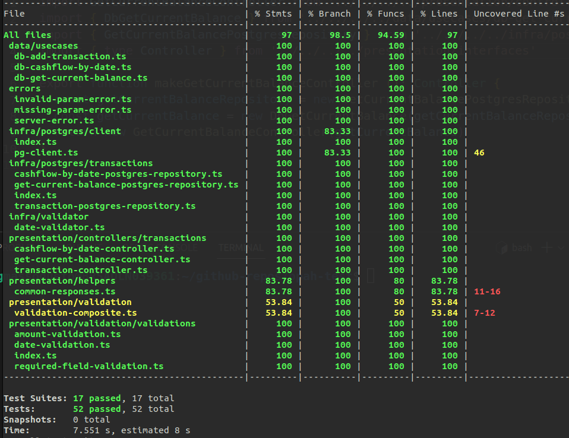

## Opah Test
* Por se tratar de um sistema financeiro, optei em fazer a aplicação utilizando o mínimo de depedências node possível, para minimizar a possibilidade de vulnerabilidades.
* O sistema não conta com suporte para multiplos comerciantes, e não possui sitema de autenticação. Isso pode ser extendido a qualquer momento no código. 
* A aplicação possui alta cobertura de testes. Execute-os (após subir a aplicação) usando o comando `make test`
* O código utiliza fortemente princípios SOLID, e facilmente nota-se a implementação de diversos padrões de design. A estrutura de classes está fortemente coesa e fracamente acoplada.
* Em caso de dúvidas e sugestões, estou à disposição.

### Cobertura dos testes


## Requisitos
* [Node 20+](https://nodejs.org/en)
* [Docker](https://docs.docker.com/engine/install/) e [Docker Compose](https://docs.docker.com/compose/)


## Como rodar a aplicação

### Para usuários Linux (Debian)
**1. Instale o pacote buid-essential:**
 ```shell
 sudo apt-get install build-essential
 ```
**2. Gerar os arquivos *compose.env* e *.env*:**
```shell 
make env
```
*Para rodar a aplicação completamente containerizada (banco de dados + migrações + aplicacação node) (ignore passos 3 e 4):*  
```shell
make up
```
**3. Para instalar as dependências do node:**
```shell
make install
```
**4. Escolha entre:**  
*Executar a aplicação sem a necessidade de transpilar o código:*
```shell
make start-ts
```   
*Executar a aplicação em javascript (transpila o código ts)*
```shell
make start-js
```

### Para usuários Windows
**1. Instale o [Gerenciador de Pacotes Chocolatey](https://chocolatey.org/install)**  
**2. Instale o pacote make (para rodar comandos make):**
```shell
choco install make
```
**3. Configure as variáveis de ambiente *.env* e *compose.env* a partir do *.env.sample***
*Para executar a aplicação containerizada (ignore os passos 4, e 5):*
```shell
make up
```  
*Neste caso adicione a linha no arquivo compose.env*
```shell 
POSTGRES_HOST="postgres"
``` 
**4. Para instalar as dependências do node:**
```shell
make install
```
**5. Escolha entre:**
*Executar a aplicação sem a necessidade de transpilar o código:*
```shell
make start-ts
```   
*Executar a aplicação em javascript (transpila o código ts):*
```shell
make start-js
```

### Rotas 
 
`http://localhost:8000/transactions/debit`

```vbnet
POST /transactions/debit
Request body: {
  "amount": 50.00
}

Response: 201 Created
Response body: {
  "id": "05e53de0-8da0-4d2d-9b86-d30e37dfabd6",
  "amount": 50.00,
  "type": "D",
  "datetime": "2023-05-24T19:12:32.876Z"
}
```

<br/><br/> 
`http://localhost:8000/transactions/credit`

```vbnet
POST /transactions/credit
Request body: {
  "amount": 300.00
}

Response: 201 Created
Response body: {
  "id": "08c71152-c552-42e7-b094-f510ff44e9cb",
  "amount": 300.00,
  "type": "C"
  "datetime": "2023-05-24T19:12:56.519Z"
}
```

<br/><br/>
`http://localhost:8000/transactions/balance`

```vbnet
GET /transactions/balance
Response: 200 Ok
Response body: {
  "balance": 250.00,
}
```

<br/><br/>
`http://localhost:8000/transactions/cashflow/yyyy-mm-dd`

```vbnet
GET /transactions/cashflow/{date}
Response 200 Ok
Response body: {
  "date": "2023-12-31", # formato yyyy-mm-dd
  "credits": [
    {
      "id": "08c71152-c552-42e7-b094-f510ff44e9cb",
      "amount": 300.00,
      "datetime": "2023-05-24T19:12:56.519Z"
    }
  ],
  "debits": [
    {
      "id": "05e53de0-8da0-4d2d-9b86-d30e37dfabd6",
      "amount": 50.00,
      "datetime": "2023-05-24T19:12:32.876Z"
    }
  ]
}
```

### Sobre os comandos make
Para execução de testes, migrações, transpilação, etc. leia os comentários no arquivo [Makefile](Makefile)
